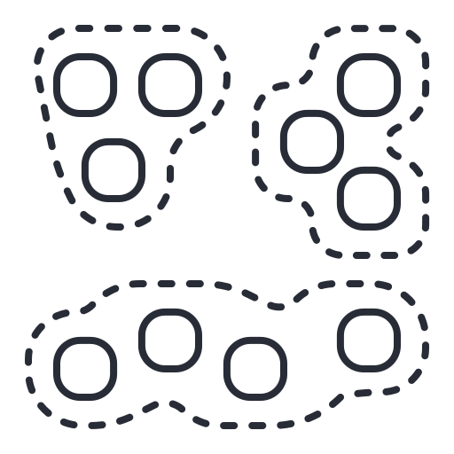

# K-Means Clustering 

This project demonstrates **unsupervised text document clustering** using the **K-Means clustering algorithm** with **Scikit-learn**.

The project retrieves articles from **Wikipedia** covering three broad subject areas - **Astronomy, Biology, and Computer Science**. The article text is cleaned and pre-processed using **NLTK**, converted into numerical **TF-IDF features**, and then grouped into clusters using **K-Means++**.

The project also demonstrates how to evaluate clustering quality using **Inertia (WCSS)** and the **Silhouette Score**, how to investigate different values of **k**, and how to use the trained model to assign a **new, unseen document** to a cluster.

> **Important:** K-Means is an **unsupervised learning** algorithm. The model does not receive the subject-area labels (Astronomy, Biology, or Computer Science) during training. It discovers groups based on similarities in the TF-IDF representations of the documents.

#### Key features of the project include,

- Retrieving Wikipedia articles programmatically using `wikipediaapi`.
- Working with text documents from three broad subject areas.
- Cleaning and preparing natural language text using **NLTK**.
- Converting text to lowercase.
- Removing punctuation, numbers, and other non-letter characters.
- Removing common English stop words.
- Applying **lemmatization** using `WordNetLemmatizer`.
- Converting processed documents into numerical features using **TF-IDF**.
- Limiting the TF-IDF representation to the **1,000 most important features**.
- Applying **K-Means++ clustering** using Scikit-learn.
- Setting `k = 3` for the initial clustering experiment.
- Examining the cluster labels assigned to each document.
- Measuring cluster compactness using **Inertia (WCSS)**.
- Evaluating cluster separation using the **Silhouette Score**.
- Testing multiple values of `k` to investigate the optimum number of clusters.
- Visualising Inertia and Silhouette Score values using Matplotlib.
- Identifying the suggested `k` using the highest Silhouette Score.
- Applying the trained model to a **new, unseen document**.
- Using the same preprocessing and TF-IDF representation for new documents.

---

## Project Structure

```text
k-means-clustering-using-scikit-learn/

│
├── k-means clustering using scikit learn.ipynb
├── LICENSE.txt
├── requirements.txt
├── .gitignore
├── assets/
│   └── logo.png
│   └── k-means evaluation.png
└── README.md
```

---

# Understanding K-Means Clustering

**K-Means clustering** is an **unsupervised machine learning algorithm** used to divide data into a specified number of groups called **clusters**.

Unlike supervised learning algorithms, K-Means does not require predefined target labels during training.

For example, in a supervised classification problem, we might tell the model:

```text
Document 1 → Astronomy
Document 2 → Biology
Document 3 → Computer Science
```

With K-Means clustering, these labels are **not provided to the algorithm**.

Instead, K-Means examines the numerical representation of the documents and attempts to group documents that are similar to one another.

In this project, the documents are Wikipedia articles and the numerical representation is produced using **TF-IDF**.

The overall process can be represented as:

```text
Wikipedia Articles
        ↓
Text Pre-processing
        ↓
TF-IDF Feature Extraction
        ↓
Numerical Document Vectors
        ↓
K-Means Clustering
        ↓
Cluster Assignments
        ↓
Cluster Evaluation
        ↓
Predict Cluster for New Document
```

---

# Dataset

Unlike projects that use a fixed CSV dataset, this project retrieves its documents directly from **English Wikipedia** using the `wikipediaapi` library.

The following nine Wikipedia articles are requested:

| Broad Subject Area | Wikipedia Articles |
|--------------------|--------------------|
| Astronomy | Galaxy |
| Astronomy | Black hole |
| Astronomy | Supernova |
| Biology | DNA |
| Biology | Photosynthesis |
| Biology | Evolution |
| Computer Science | Machine learning |
| Computer Science | Computer programming |
| Computer Science | Artificial intelligence |

Therefore, the project works with:

```text
Number of documents = 9
```

The three broad subject areas are used to provide meaningful topics for exploring whether K-Means can discover groups of related documents.

**Important:** The subject-area categories are used for understanding the dataset and interpreting the results. They are **not supplied to K-Means as target labels**.

---

# Fetching Wikipedia Articles

The project uses the `wikipediaapi` library to retrieve article content from English Wikipedia.

The article titles are stored in a Python list:

```python
article_titles = [
    "Galaxy", "Black hole", "Machine learning",
    "DNA", "Photosynthesis", "Computer programming", 
    "Evolution", "Supernova", "Artificial intelligence"
]
```

A Wikipedia API client is then created:

```python
wiki_api = wikipediaapi.Wikipedia(
    "My-Clustering-Project/1.0.0",
    "en"
)
```

The code loops through each article title and checks whether the requested page exists.

If the page exists, its complete text is added to the `documents` list.

The notebook successfully retrieves all nine requested articles:

```text
Successfully fetched: Galaxy
Successfully fetched: Black hole
Successfully fetched: Machine learning
Successfully fetched: DNA
Successfully fetched: Photosynthesis
Successfully fetched: Computer programming
Successfully fetched: Evolution
Successfully fetched: Supernova
Successfully fetched: Artificial intelligence
```

Each article is treated as one **document** for the remainder of the machine learning workflow.

---

# Text Pre-processing

Raw Wikipedia text contains many elements that are not directly useful for numerical text analysis.

Therefore, the project performs several text preprocessing operations before applying TF-IDF.

The preprocessing process includes:

1. Converting text to lowercase.
2. Removing punctuation and non-letter characters.
3. Splitting text into individual words.
4. Removing English stop words.
5. Applying lemmatization.
6. Combining the processed words back into a text string.

The preprocessing function is:

```python
def preprocess_text(text):
    text = text.lower()

    text = re.sub(r"[^a-z\s]", "", text)

    words = text.split()

    processed_words = [
        lemmatizer.lemmatize(word, pos="v")
        for word in words
        if word not in stop_words
    ]

    return " ".join(processed_words)
```

---

# Lowercasing

The first preprocessing operation converts all characters to lowercase:

```python
text = text.lower()
```

This helps ensure that words such as:

```text
Computer
computer
COMPUTER
```

are treated consistently rather than as different terms.

---

# Removing Punctuation and Non-Letter Characters

The project uses a regular expression to remove characters that are not lowercase English letters or spaces:

```python
text = re.sub(r"[^a-z\s]", "", text)
```

This removes items such as punctuation and numbers from the text.

For example, text containing:

```text
Machine learning, version 2.0!
```

is converted into a cleaner representation containing the words:

```text
machine learning version
```

---

# Removing Stop Words

The project uses NLTK's built-in English stopword list:

```python
stop_words = set(stopwords.words("english"))
```

The notebook reports:

```text
Number of stop words: 198
```

Stop words are common words such as:

```text
the
is
and
of
in
```

These words frequently occur across many documents and may provide relatively little information for distinguishing document topics.

The preprocessing function removes words found in the stopword set:

```python
if word not in stop_words
```

---

# Lemmatization

The project uses NLTK's `WordNetLemmatizer`:

```python
lemmatizer = WordNetLemmatizer()
```

Lemmatization attempts to convert words into their base or dictionary form.

For example:

```text
running → run
played  → play
```

The project uses:

```python
lemmatizer.lemmatize(word, pos="v")
```

The `pos="v"` argument tells the lemmatizer to treat the word as a verb when determining its base form.

Lemmatization can help reduce different forms of a word to a common representation.

---

# Example of Text Pre-processing

The notebook displays part of the first Wikipedia article before and after preprocessing.

### Before preprocessing

```text
A galaxy is a physical system of stars, planetary systems,
stellar remnants, substellar objects, interstellar gas...
```

### After preprocessing

```text
galaxy physical system star planetary systems stellar remnants
substellar object interstellar gas dust dark matter bind together...
```

The processed text is then ready to be converted into numerical features.

---

# TF-IDF Feature Extraction

Machine learning algorithms such as K-Means cannot directly work with raw text.

Therefore, the processed documents are converted into numerical vectors using **TF-IDF**.

TF-IDF stands for:

**Term Frequency-Inverse Document Frequency**

The project uses Scikit-learn's:

```python
TfidfVectorizer(max_features=1000)
```

TF-IDF assigns numerical values to terms based on their importance within the documents.

A simplified interpretation is:

- A word occurring frequently in a particular document can receive a higher importance.
- A word occurring in many documents becomes less useful for distinguishing documents.
- A word that is important to one document but uncommon across other documents can receive a higher TF-IDF value.

---

# Limiting the Number of Features

The vectorizer is configured as:

```python
TfidfVectorizer(max_features=1000)
```

This means that the TF-IDF representation is limited to a maximum of **1,000 features**.

The resulting matrix has the shape:

```text
(9, 1000)
```

This means:

| Dimension | Meaning |
|-----------|---------|
| 9 | Number of documents |
| 1,000 | Number of TF-IDF features |

Therefore, each Wikipedia article is represented as a numerical vector containing up to 1,000 TF-IDF features.

---

# Sparse Matrix Representation

The TF-IDF matrix is displayed as a **Compressed Sparse Row (CSR) sparse matrix**:

```text
Compressed Sparse Row sparse matrix
of dtype 'float64'
with 5237 stored elements
and shape (9, 1000)
```

The matrix contains:

```text
9 × 1000 = 9000
```

possible document-feature positions.

However, only **5,237** of these positions contain non-zero values.

This demonstrates why a sparse matrix is useful for text data: many possible terms do not occur in every document.

The resulting TF-IDF matrix is therefore stored efficiently as a sparse representation.

---

# Applying K-Means++ Clustering

The project applies the **K-Means clustering algorithm** using Scikit-learn.

The initial experiment uses:

```python
k = 3
```

This means that K-Means is instructed to create three clusters.

The model is created using:

```python
kmeans = KMeans(
    n_clusters=k,
    random_state=42,
    n_init=10
)
```

The model is then fitted using the TF-IDF matrix:

```python
kmeans.fit(tfidf_matrix)
```

---

# Why Use k = 3?

The dataset contains articles from three broad subject areas:

```text
Astronomy
Biology
Computer Science
```

Therefore, the initial experiment uses:

```text
k = 3
```

However, this does **not** mean that K-Means knows these three subject areas.

K-Means simply receives:

```text
TF-IDF document vectors
```

and is instructed to create three clusters.

The algorithm determines the groups based on similarities between the numerical document representations.

---

# Understanding Cluster Centroids

A central concept in K-Means is the **cluster centroid**.

A centroid represents the centre of a cluster in the feature space.

In this project, every document is represented as a TF-IDF vector. K-Means attempts to position a centroid so that documents assigned to the same cluster are relatively close to that centroid.

Conceptually:

```text
              Document
                 ●
              ●     ●
                 ↓
             Centroid
                 ●
              ●     ●
```

During training, K-Means repeatedly:

1. Assigns each document to its nearest centroid.
2. Recalculates the centroid based on the assigned documents.
3. Reassigns documents based on the updated centroids.
4. Continues until the clustering stabilises or the algorithm reaches its stopping conditions.

The objective is to create compact groups of similar documents.

---

# K-Means++ Initialisation

The project uses Scikit-learn's `KMeans` implementation, which uses **K-Means++ initialisation** by default.

The model configuration includes:

```python
n_init=10
```

This means K-Means is run multiple times with different initial centroid positions and the best result is retained.

Using multiple initialisations helps reduce the possibility that an unfortunate initial centroid configuration will produce a poor clustering solution.

---

# Cluster Labels

After training, the project retrieves the cluster assigned to every document:

```python
labels = kmeans.labels_
```

The resulting labels are:

```text
[2 2 1 0 0 1 0 2 1]
```

These numbers represent cluster IDs.

For example:

```text
0 → Cluster 0
1 → Cluster 1
2 → Cluster 2
```

The numerical labels themselves do **not** inherently mean:

```text
0 = Astronomy
1 = Biology
2 = Computer Science
```

Cluster numbers are simply identifiers assigned by the K-Means implementation.

The meaning of each cluster must be interpreted by examining the documents grouped into that cluster.

---

# Cluster Assignment Overview

The initial clustering result can be viewed as:

| Article | Cluster |
|---------|--------:|
| Galaxy | 2 |
| Black hole | 2 |
| Machine learning | 1 |
| DNA | 0 |
| Photosynthesis | 0 |
| Computer programming | 1 |
| Evolution | 0 |
| Supernova | 2 |
| Artificial intelligence | 1 |

The resulting grouping shows a strong topic-oriented pattern in this example:

| Cluster | Main Topic Pattern |
|---------|--------------------|
| Cluster 0 | Biology-related articles |
| Cluster 1 | Computer Science-related articles |
| Cluster 2 | Astronomy-related articles |

This demonstrates how an unsupervised algorithm can discover meaningful groups from document similarity without being provided with the subject labels.

---

# Evaluating the Clustering Results

Clustering does not use traditional classification accuracy because there are no target labels supplied to the model during training.

Instead, the project uses two important clustering evaluation measures:

- **Inertia (WCSS)**
- **Silhouette Score**

These metrics provide different information about the quality of the clusters.

---

# Inertia / WCSS

K-Means calculates a value called **inertia**, also known as **Within-Cluster Sum of Squares (WCSS)**.

The project obtains this value using:

```python
wcss = kmeans.inertia_
```

WCSS measures how close documents are to the centroid of their assigned cluster.

A lower value generally indicates that documents are more compactly grouped around their cluster centroids.

For the initial model with:

```text
k = 3
```

the notebook reports:

```text
WCSS (Inertia): 4.4569
```

### Important consideration

Inertia generally decreases as the number of clusters increases.

Therefore, a lower inertia value by itself does **not** automatically mean that a particular value of `k` is the best choice.

This is why the project also considers the Silhouette Score.

---

# Silhouette Score

The project calculates the Silhouette Score using:

```python
sil_score = silhouette_score(
    tfidf_matrix,
    kmeans.labels_
)
```

The Silhouette Score considers both:

1. How similar a document is to other documents in its own cluster.
2. How different the document is from documents in other clusters.

The score ranges from:

```text
-1 to +1
```

A general interpretation is:

| Silhouette Score | General Interpretation |
|------------------|------------------------|
| Close to +1 | Well-separated clusters |
| Around 0 | Overlapping clusters |
| Below 0 | Some documents may be assigned to inappropriate clusters |

For the initial `k = 3` model, the notebook reports:

```text
Silhouette Score: 0.1080
```

This is a relatively low Silhouette Score, indicating that although the clustering produces a meaningful topic grouping in this small example, the clusters are not strongly separated according to this metric.

This is an important lesson: **a clustering result can appear intuitively meaningful while still having relatively weak numerical separation**.

---

# Finding the Optimum Number of Clusters

One of the challenges of K-Means is deciding the appropriate value of `k`.

The algorithm requires the number of clusters to be specified before training.

Instead of assuming that `k = 3` is always optimal, the project tests several possible values.

The number of documents is obtained using:

```python
num_docs = tfidf_matrix.shape[0]
```

Since there are nine documents:

```text
num_docs = 9
```

The project tests:

```python
k_values = range(2, num_docs)
```

Therefore, the tested values are:

```text
2, 3, 4, 5, 6, 7, 8
```

The project does not test `k = 1` because a Silhouette Score requires at least two clusters.

It also does not test `k = 9` because having one cluster per document would not provide a useful clustering solution for this experiment.

---

# Evaluating Different Values of k

For every value of `k`, the project:

1. Creates a new K-Means model.
2. Trains the model.
3. Stores the Inertia value.
4. Calculates the Silhouette Score.
5. Stores the Silhouette Score.

The values are stored in:

```python
inertia_values = []
silhouette_values = []
```

The results are then visualised using Matplotlib.

---

# K-Means Evaluation Graph

The project creates a graph containing:

- Number of clusters (`k`) on the x-axis.
- Inertia (WCSS) on one y-axis.
- Silhouette Score on the other y-axis.


The graph allows us to observe how the clustering metrics change as the number of clusters increases.

The project uses two y-axes because Inertia and Silhouette Score have different numerical scales.

The highest Silhouette Score is then identified using:

```python
best_k_index = silhouette_values.index(
    max(silhouette_values)
)

best_k = k_values[best_k_index]
```

The notebook reports:

```text
Suggested optimal number of clusters by silhouette score: k = 3
```

Therefore, based on the highest Silhouette Score among the tested values:

```text
Suggested optimal k = 3
```

This agrees with the initial choice of three clusters based on the three broad subject areas represented in the documents.

---

# Predicting a New Document

After training the model, the project demonstrates how to assign a cluster to a **new document** that was not included in the original nine Wikipedia articles.

The example document discusses:

- Algorithms
- Data structures
- Computer science
- Software
- Arrays
- Hash tables

The new document begins as:

```python
new_text = (
    "An algorithm is a set of well-defined instructions designed "
    "to perform a specific task or solve a computational problem. "
    "In computer science, the study of algorithms is fundamental "
    "to creating efficient and scalable software. Data structures, "
    "such as arrays and hash tables, are used to organize data in "
    "a way that allows these algorithms to access and manipulate "
    "it effectively."
)
```

---

# Pre-processing the New Document

The new document must go through the **same preprocessing process** used for the original documents.

The project applies:

```python
processed_new_text = preprocess_text(new_text)
```

The resulting cleaned text is:

```text
algorithm set welldefined instructions design perform specific task
solve computational problem computer science study algorithms
fundamental create efficient scalable software data structure
array hash table use organize data way allow algorithms access
manipulate effectively
```

Using the same preprocessing process is important because the model was trained using a particular representation of text.

---

# Converting the New Document into TF-IDF

The new document is converted into a TF-IDF vector using the existing vectorizer:

```python
new_tfidf_vector = vectorizer.transform(
    [processed_new_text]
)
```

The important point here is that the project uses:

```python
transform()
```

rather than:

```python
fit_transform()
```

The TF-IDF vectorizer has already learned its vocabulary from the original documents.

The new document must therefore be represented using the **same vocabulary and feature space**.

The resulting vector has the shape:

```text
(1, 1000)
```

This means:

- `1` → one new document.
- `1000` → the same 1,000 TF-IDF features used by the trained model.

---

# Predicting the Cluster

The trained K-Means model is then used to predict the cluster:

```python
predicted_label = kmeans.predict(
    new_tfidf_vector
)
```

The notebook reports:

```text
The new document belongs to cluster: 1
```

Therefore, the new document is assigned to:

```text
Cluster 1
```

From the earlier clustering result, Cluster 1 is primarily associated with **Computer Science-related documents**.

This is consistent with the content of the new document, which focuses on algorithms, data structures, and software.

---

# Complete Machine Learning Workflow

The complete workflow implemented in the notebook can be summarised as follows:

```text
1. Import Required Libraries
            ↓
2. Configure SSL
            ↓
3. Download NLTK Resources
            ↓
4. Retrieve Wikipedia Articles
            ↓
5. Pre-process Text
   ├── Lowercase
   ├── Remove non-letter characters
   ├── Tokenise
   ├── Remove stop words
   └── Lemmatise
            ↓
6. Convert Text to TF-IDF
            ↓
7. Create K-Means Model
            ↓
8. Train K-Means
            ↓
9. Obtain Cluster Labels
            ↓
10. Evaluate Clustering
    ├── Inertia / WCSS
    └── Silhouette Score
            ↓
11. Test Multiple k Values
            ↓
12. Identify Suggested k
            ↓
13. Pre-process New Document
            ↓
14. Transform New Document Using Existing TF-IDF Vectorizer
            ↓
15. Predict Its Cluster
```

---

# Results Summary

The main results from the notebook are:

| Metric / Result | Value |
|-----------------|------:|
| Number of documents | **9** |
| TF-IDF features | **1,000** |
| Initial number of clusters (`k`) | **3** |
| Inertia / WCSS for `k = 3` | **4.4569** |
| Silhouette Score for `k = 3` | **0.1080** |
| Suggested optimal `k` | **3** |
| New document predicted cluster | **1** |

The initial clustering assigns the nine documents as follows:

```text
[2, 2, 1, 0, 0, 1, 0, 2, 1]
```

The resulting clusters broadly correspond to:

```text
Cluster 0 → Biology
Cluster 1 → Computer Science
Cluster 2 → Astronomy
```

The new document about algorithms and data structures is assigned to:

```text
Cluster 1
```

---

# Important Note About Cluster Labels

Cluster numbers should not be interpreted as fixed class labels.

For example:

```text
Cluster 0
```

does not inherently mean Biology.

K-Means could produce the same groups with different numerical labels in another run, such as:

```text
Cluster 0 → Computer Science
Cluster 1 → Astronomy
Cluster 2 → Biology
```

The important information is **which documents are grouped together**, rather than the numerical value of the cluster label.

---

# Important Note About the Evaluation Results

The project uses only **nine documents**, which is a very small dataset for a machine learning experiment.

As a result, the clustering results should be treated primarily as an **educational demonstration** rather than evidence of a production-quality document clustering system.

The Silhouette Score of:

```text
0.1080
```

also indicates relatively weak separation according to that metric.

Nevertheless, the example is useful for understanding the complete workflow of:

```text
Text → Pre-processing → TF-IDF → K-Means → Evaluation → Prediction
```

A larger collection of documents would provide a more robust environment for evaluating clustering performance.

---

# Used Technologies

- Python
- NumPy
- NLTK
- Wikipedia API
- SSL
- Scikit-learn
- Matplotlib
- Jupyter Notebook

### Natural Language Processing Techniques

- Text preprocessing
- Tokenisation
- Stop-word removal
- Lemmatization
- TF-IDF feature extraction

### Machine Learning Techniques

- Unsupervised Learning
- K-Means Clustering
- K-Means++ initialisation
- Cluster centroid-based grouping
- Inertia / WCSS
- Silhouette Score
- Cluster prediction

### Used Integrated Development Environment

- VS Code

---

# How to Use?

Clone this repository:

```bash
git clone https://github.com/PubuduJ/k-means-clustering-using-scikit-learn.git
```

Navigate to the project directory:

```bash
cd k-means-clustering-using-scikit-learn
```

Install the required dependencies:

```bash
pip install -r requirements.txt
```

Alternatively, install the main libraries manually:

```bash
pip install wikipediaapi nltk ssl re numpy scikit-learn matplotlib
```

Open the Jupyter Notebook using:

- Jupyter Notebook
- JupyterLab
- VS Code
- Another compatible Python IDE

Run the notebook cells sequentially.

> **Internet connection required:** The notebook retrieves article content directly from Wikipedia, so an active internet connection is required when running the article-retrieval section.

> **NLTK resources:** The notebook automatically downloads the required NLTK resources (`stopwords`, `wordnet`, and `omw-1.4`) when the relevant cells are executed.

---

# Learning Outcomes

This project demonstrates how to:

- Understand the fundamentals of **unsupervised machine learning**.
- Understand the purpose of **K-Means clustering**.
- Distinguish between **supervised** and **unsupervised** learning.
- Work with real-world textual documents.
- Retrieve data programmatically from Wikipedia.
- Understand the importance of text preprocessing.
- Convert text to lowercase.
- Remove unwanted characters using regular expressions.
- Understand **tokenisation**.
- Remove common English stop words.
- Understand **lemmatization**.
- Understand the purpose of **TF-IDF**.
- Convert textual documents into numerical feature vectors.
- Understand **sparse matrices** in text processing.
- Understand the role of **cluster centroids**.
- Apply the **K-Means++** clustering algorithm.
- Understand the purpose of the `k` parameter.
- Interpret K-Means cluster labels correctly.
- Understand **Inertia / WCSS**.
- Understand the **Silhouette Score**.
- Evaluate different values of `k`.
- Use the Silhouette Score to suggest an appropriate number of clusters.
- Visualise clustering evaluation metrics.
- Understand why a low Silhouette Score may indicate overlapping clusters.
- Apply a trained clustering model to a **new unseen document**.
- Use `transform()` to represent new text using an existing TF-IDF feature space.
- Interpret the cluster assigned to a new document.
- Understand the limitations of evaluating machine learning models using a very small dataset.

---

# Version

**v1.0.0**

---

# References

The following resources were consulted to support the understanding and implementation of **TF-IDF** and **TF-IDF Vectorizer** in this project.

[**1. GeeksforGeeks - Understanding TF-IDF (Term Frequency-Inverse Document Frequency)**](https://www.geeksforgeeks.org/machine-learning/understanding-tf-idf-term-frequency-inverse-document-frequency/)

[**2. GeeksforGeeks - How to Store a TfidfVectorizer for Future Use in Scikit-learn**](https://www.geeksforgeeks.org/nlp/how-to-store-a-tfidfvectorizer-for-future-use-in-scikit-learn/)

---

# License

Copyright &copy; 2026 [**Pubudu Janith**](https://www.linkedin.com/in/pubudujanith/). All Rights Reserved.

This project is licensed under the [**MIT License**](LICENSE.txt).